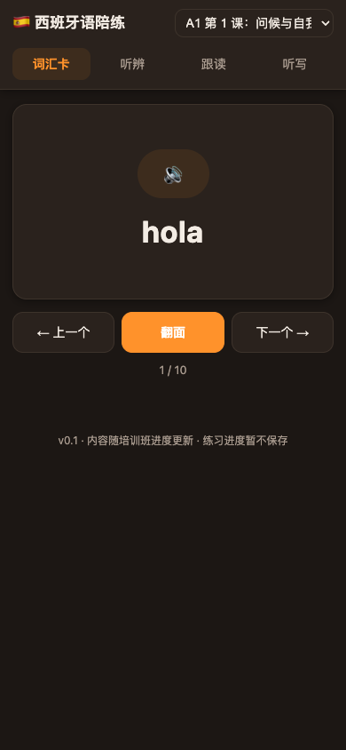
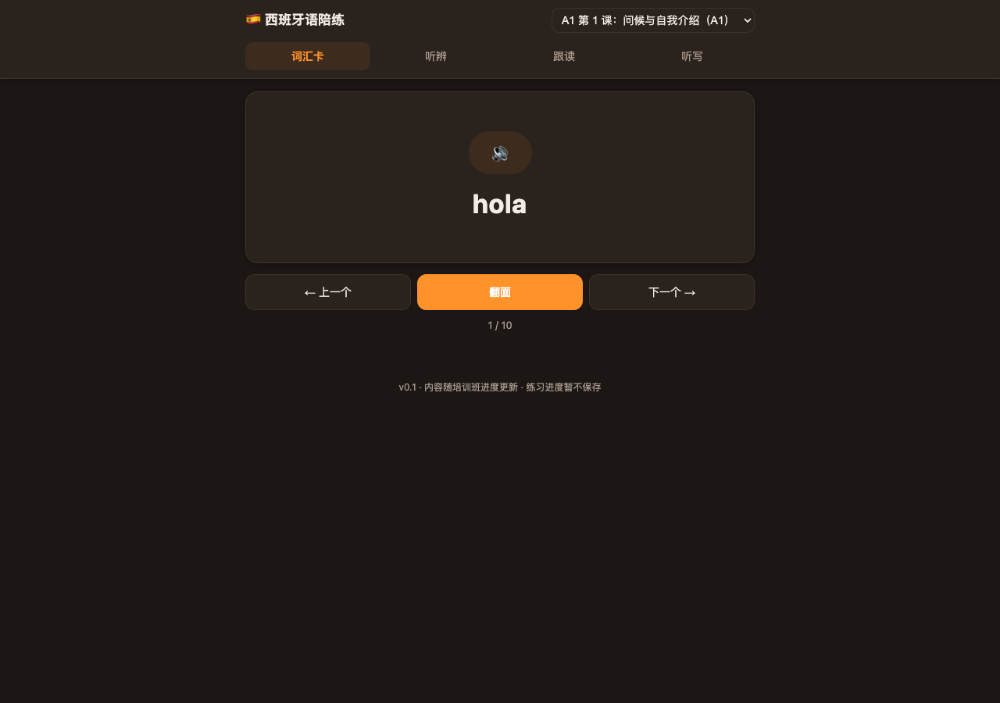
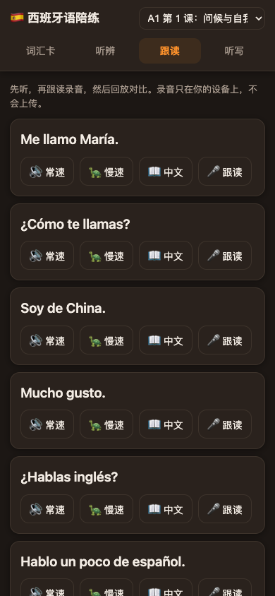

<div align="center">

# 🇪🇸 西班牙语陪练 · Learning Spanish

**为中文母语零基础学习者打造的"听说优先"西语练习系统**
内容与 BLCU《现代西班牙语》课堂同步 · 学习数据自动云同步 · 手机 / 电脑都能用

`v0.7` · 17 个学习包 · 174 词汇 · 141 听辨对 · 161 句型 · 952 段音频 · 零依赖

[快速开始](#-快速开始) · [特性](#-特性) · [内容体系](#-内容体系) · [架构](#-架构) · [路线图](#-路线图) · [更新记录](CHANGELOG.md)

</div>

---

## ✨ 特性

| 模块 | 说明 |
|---|---|
| 🗣 **发音基础** | 按《西班牙语发音讲义》制作：b/v、p、g、d、r/rr、ll、ch 代表词 + 8 组对立听辨，专治中文母语者发音难点 |
| 🃏 **词汇卡** | 翻面记忆 + 例句发音 + 英语同源词提示（restaurante → restaurant，白送词汇量）+ SRS 间隔重复 |
| 👂 **听辨** | 7 类中文母语难点音素最小对立对（b/v、p/b、t/d、l/r、r/rr、元音、重音），全部真实西语词 |
| 🎤 **跟读** | 常速 / 慢速两档 + 本地录音回放 + 发音评分（Web Speech es-ES，iPhone 不可用时优雅降级） |
| ✍️ **听写** | 常速 / 慢速 + 自动判对（忽略大小写、重音、标点） |
| 📊 **报告** | 连续打卡热力图（近 8 周）、今日练习量、到期复习卡、已学词汇——学习数据自动云同步，换设备不丢 |
| 📱 **PWA** | iPhone 添加到主屏幕后全屏使用，离线可练（进度本机兜底，联网自动合并） |

## 📸 截图

| 手机端（390px） | 桌面端 |
|---|---|
|  |  |
|  |  |
|  |  |
|  |  |

## 🚀 快速开始

### 给学习者（零操作）

打开线上地址即可开始（无需安装、无需登录）：
**https://wsj414855138-code.github.io/espanol/app/**（网络受限时挂梯子访问）

iPhone 体验升级：Safari 打开 → 分享 → **"添加到主屏幕"** → 全屏像 App 一样用。
学习进度自动云端同步——清缓存、换手机都不丢，断网也能练（联网自动补传）。

### 给开发者 / AI 协作

```bash
# 1) 启动本地练习页
node scripts/serve.mjs 8000          # 打开 http://localhost:8000/app/

# 2) 内容流水线（教材 Markdown → 学习包 → 音频）
node scripts/build-pack.mjs --all     # data/raw/*/source.md → data/packs/*/pack.json
node scripts/generate-audio.mjs --all # edge-tts 神经语音 → m4a（常速+慢速双档）

# 3) 质量校验（改任何东西后必跑）
node scripts/verify-audio.mjs --http  # 文件 + 媒体头（Content-Length / Accept-Ranges / Range-206）
node scripts/verify-playback.mjs      # 真实浏览器点击播放验证

# 4) 部署线上（GitHub Pages，1-2 分钟自动发布）
bash scripts/deploy-pages.sh
```

**Anki 导出**（可选，配合 Anki 间隔重复）：

```bash
node scripts/export-anki.mjs --all    # 每包生成 anki-vocab.tsv / anki-sentences.tsv + anki-media/
```

Anki 导入：工具 → 管理笔记类型 → 添加基础卡（字段：`西语|中文|例句|例句中文|音频`）→ 文件 → 导入 TSV（制表符分隔）→ 把 `anki-media/` 文件拷进 Anki 媒体文件夹。

## 📚 内容体系（与课本同步）

全部内容来自 **BLCU 培训班教材**（《现代西班牙语》第一册学案 + 课文 + 发音讲义），按上课顺序排列：

```
发音基础 → 第1课（学案+课文）→ 第2-3课（学案+课文×2）→ 第4-5课（学案+课文×2）
→ 第6-7课（学案+课文×2）→ （通用示例包排最后）
```

- 17 个学习包，每包：词汇 8-12 + 听辨 7-8 对 + 句型 8-12 句
- 952 段音频（edge-tts 微软神经语音 `es-ES-ElviraNeural`，常速 + 慢速双档）
- 原料格式：`data/raw/<课程>/source.md`（Markdown 表格，见 [docs/design.md](docs/design.md) 格式说明），任何 AI 或人可维护
- 听辨设计围绕 **7 类中文母语难点音素**：b/v、p/b、t/d、l/r、r/rr、元音、重音

## 🏗 架构

```
data/raw/*.md（唯一手改入口）
      │  build-pack.mjs
      ▼
data/packs/*/pack.json（生成物，勿手改）
      │  generate-audio.mjs
      ▼
data/packs/*/audio/*.m4a（edge-tts → afconvert 转码，常速+慢速）
      │
      ▼
app/（纯静态页面：词汇 / 听辨 / 跟读 / 听写 / 报告）
      │
      ├── 本地：node scripts/serve.mjs
      └── 线上：GitHub Pages（app/ + data/ 同构直出）
```

**设计原则**

- 单向流水线：原料只手改、产物只生成，任何 AI 接手几小时可上手
- 零依赖：Node 标准库 + 原生 HTML/CSS/JS，无构建步骤，任何静态托管可跑
- 云端只存学习记录、不存内容：内容永远在本地仓库，可迁移
- 三层校验文化：文件 → HTTP 媒体头 → 真实浏览器播放，改完必跑（教训见 [交接文档-音频无声.md](交接文档-音频无声.md)：Safari 要求 Content-Length + Range-206，Chrome 容忍错误头部导致测试全过真机无声）

## 🛠 技术栈

| 层 | 选型 | 为什么 |
|---|---|---|
| 前端 | 原生 HTML/CSS/JS + PWA | 零构建零依赖；iOS 添加到主屏幕即 App 体验 |
| TTS | edge-tts（es-ES-ElviraNeural） | 微软神经语音，自然度明显优于系统音；`say` 离线兜底 |
| 数据同步 | Supabase（匿名身份 + RLS） | 免费额度够用、免登录、学习记录云端备份 + 离线兜底 |
| 视觉/多模态 | Kimi K2.7（pi CLI） | UI 走查、录屏分析、教材 OCR 校对 |
| 部署 | GitHub Pages | 免费、git 驱动、静态托管与项目天然契合 |
| 教学依据 | [docs/evidence.md](docs/evidence.md) | 每项机制有 meta 分析/研究/产品实践分级引用（🟢🟡🔵⚪），不拍脑袋 |

## 📁 目录结构

```
app/                练习页（index.html / app.js / cloud.js / sw.js / manifest）
data/materials/     外挂资料库（唯一归档处）：真实教材 / 录屏 / 讲义等原始素材
data/raw/           原料：教材 Markdown（唯一手改入口）+ ocr-draft/ 扫描件草稿
data/packs/         生成物：pack.json + 音频 + Anki 卡组（勿手改）
scripts/            流水线与工具（build / generate-audio / ocr / verify / serve / deploy）
docs/               设计、调研、证据、路线图、进度日志、截图
```

## 🗺 路线图

见 [docs/roadmap-v2.md](docs/roadmap-v2.md)：

| 版本 | 内容 | 状态 |
|---|---|---|
| v0.5 | 学习记录上云（Supabase 匿名身份 + 离线兜底） | ✅ 2026-08-16 |
| v0.6 | 学习报告（打卡热力图 / 摘要卡） | ✅ 2026-08-16 |
| v0.7 | PWA（manifest / 图标 / 离线缓存） | ✅ 2026-08-16 |
| v0.8 | 音素级发音评分（SpeechSuper，西语唯一音素级诊断厂商） | ⏳ 询价中 |
| v0.9 | AI 对话陪练（DeepSeek 驱动） | ⏳ 待基础巩固 |
| v1.0 | 内容扩展（A1→A2）、教材全文 OCR | ⏳ 规划 |

## 📜 更新记录

完整版本迭代历史（v0.1 → v0.7）见 **[CHANGELOG.md](CHANGELOG.md)**。

## 📄 文档导航

| 文档 | 内容 |
|---|---|
| [docs/learner-guide.md](docs/learner-guide.md) | 学习者：15 分钟四步日常循环 + 毕业标准 |
| [docs/design.md](docs/design.md) | 产品设计（听说优先、中文母语难点表、ADR） |
| [docs/research.md](docs/research.md) | 市场应用与开源项目调研 |
| [docs/evidence.md](docs/evidence.md) | 教学依据与证据分级（🟢🟡🔵⚪） |
| [docs/speech-eval-research.md](docs/speech-eval-research.md) | 发音评测引擎调研（SpeechSuper vs 国内大厂） |
| [docs/progress.md](docs/progress.md) | 逐日开发日志 |
| [交接文档-音频无声.md](交接文档-音频无声.md) | 音视频链路排查交接文档 |

## ⚖️ 许可

代码部分 MIT；内容素材来自 BLCU 培训班教学资料（仅供学习者个人使用，不对外发行）。
